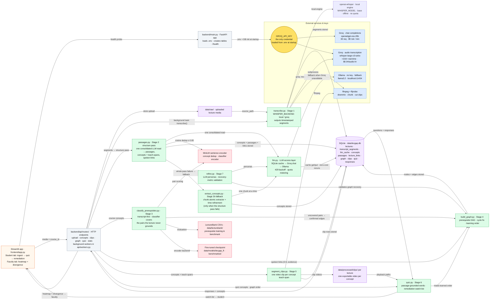

# Lecture Comprehension Gap Detector (LecGap)

## What this is

LecGap automatically learns the prerequisite structure of a course directly
from lecture recordings — instead of requiring someone to hand-type which
concept depends on which — and uses that learned structure to power two
things:

1. **Personalized remediation for students** — when a student fails a quiz
   question, the system doesn't just show them what they got wrong, it shows
   them the *correct learning order* based on what actually depends on what.
2. **Diagnostic analytics for instructors** — an aggregated view of where a
   class got confused, and where the order a concept was *taught* diverges
   from the order the data suggests it should have been *learned*.

## The core claim

Most AI study tools either skip prerequisite structure entirely or require
it to be manually curated. LecGap automatically constructs a prerequisite
concept graph from raw lecture audio and visual content, evaluates that
graph against a public benchmark, and continuously refines it using real
quiz-performance signals — closing the loop from raw video to a structured,
self-correcting curriculum model.

## Why this isn't "just another AI study app"

Tools like YouLearn, Knowt, and NotebookLM already do transcript-based quiz
generation and weak-spot review at scale. That loop is **not** the
contribution here, and this project does not claim it is — it's necessary
infrastructure, not the pitch. None of those tools do:

- An automatically learned, *evaluated*, directional prerequisite graph
  (not a generic "related topics" mind map)
- Any concept of a classroom — no multi-student aggregation, no
  instructor-facing analytics
- A mechanism that gets more accurate over time from real usage signals

See `plan/EVALUATION.md` for how the prerequisite graph and refinement loop
are actually tested, and `plan/LIMITATIONS.md` for an honest account of
where this project's claims stop.

## Project status

Implementation underway, phased by complexity (see `plan/ROADMAP.md`):

- **Phase 0 — Setup & research: done.** Environment verified; test lectures in `data/raw/`.
- **Phase 1 — Transcription pipeline: done.** Lecture upload → background Whisper
  transcription → timestamped segments persisted to SQLite, served over the API.
  Verified end-to-end against a real CampusX lecture recording.
- **Phase 2 — Concept extraction: done, rebuilt as the Lecture-Structure pass.**
  Spoken concepts are extracted by **one consolidated LLM read** of the
  transcript (`backend/pipeline/passages.py`) — sliding windows + rolling
  context — that emits **passages** (span/title/kind/summary/text), each
  concept's precise **teach-span**, and **spoken prerequisite links** with
  verbatim evidence. This replaces the old chunk-atomic extractor + Stage 2b
  time-anchor refinement (now retained only as the whole-pass fallback).
  Design: `plan/LECTURE_STRUCTURE.md`.
- **Phase 3 — Prerequisite classification: done — transcript-first, frozen-encoder classifier as fallback.**
  - Edges the professor *voices* in the lecture are primary (`source_method="transcript"`,
    confidence 0.9, verbatim evidence stored).
  - `backend/pipeline/classify_prerequisites.py` — candidate-pair pre-filter
    (temporal + embedding similarity) and the **adopted classifier**: frozen
    MiniLM encoder + logistic head over the LectureBank pairs.
  - `scripts/evaluate_classifier.py` — nested 5-fold CV with honest
    threshold selection; **F1 0.569** on LectureBank 1.0.
  - Cross-encoder fine-tuning (MiniLM *and* bigger MPNet backbone) was
    exhaustively explored as the "better alternative" via the Kaggle GPU
    notebooks (`notebooks/kaggle_fine_tune.ipynb`,
    `notebooks/kaggle_fine_tune_mpnet.ipynb`). More epochs helped (e3→0.49,
    e5→0.53, e8→0.554) but every configuration plateaued ~F1 0.55 and **never
    beat the frozen baseline** (MiniLM e8: 0.554, MPNet e4: 0.550 vs 0.569).
    **Decision: the frozen-encoder baseline (F1 0.569) is locked in as the
    Phase 3 classifier** and fills only the pairs the transcript never
    grounds (notably cross-lecture relations). Fine-tuning infra remains
    usable/reproducible for future iterations.
- **Phase 4 — Graph construction: done.** Confirmed prerequisite pairs become a
  per-course prerequisite DAG (`backend/pipeline/build_graph.py`):
  - *Transcript-first merge:* lecture links are added at 0.9 with evidence;
    the classifier covers only uncovered pairs; every `graph_edges` row
    carries `source_method` + `evidence` so the DAG view can show *why*.
  - *Deduplication:* new concept names are checked against existing graph nodes
    via embedding similarity before being added, so "Gradient Descent" and
    "GD optimization" from different lectures collapse into one node.
  - *Cycle resolution:* cycles are broken by dropping the lowest-confidence
    edge (confidence-weighted), then the graph is topologically sorted to give
    the learner order.
  - *Persistence:* nodes/edges live in `graph_nodes`/`graph_edges` SQLite tables
    per course (not a pickled file), so the Stage 7 refinement loop can swap
    edges safely.
  - Exposed via `POST /courses/{id}/graph` (background build) and
    `GET /courses/{id}/graph` (persisted nodes/edges + learner order +
    edge provenance).
- **Phase 5 — Clip segmentation: done.** One ffmpeg clip per concept cut on
  its teach-span (`backend/pipeline/segment_clips.py`, pure):
  - `cut_clip` — ffmpeg cut for a single concept range, **re-encoded by
    default** (`LECGAP_CLIP_STREAMCOPY=1` opts back to `-c copy`) so the cut
    is frame-accurate; surfaces timeout/missing-binary/ffmpeg errors per clip
    instead of aborting the batch.
  - `cut_concept_clips` — batch worker writing
    `data/processed/clips/<lecture_id>/<concept>__<start>-<end>.mp4`,
    skipping concepts without timestamps.
  - Cut clips persisted in the `clips` table; API:
    `POST /lectures/{id}/clips` (background cut) + `GET /lectures/{id}/clips`.

The refinement loop (Phase 7) remains the second core claim, scheduled after
this infrastructure is stable.

## Project status — continued (Phases 6–8)

- **Phase 6 — Quiz loop & remediation ordering: done.** When a student misses a
  question, the API returns the *correct learning order* built from the
  prerequisite graph:
  - `backend/pipeline/quiz.py` — `select_remediation_sequence` (transitive
    upstream closure, ordered by learner order) + `order_quiz`.
  - DB: `quiz_questions` + `quiz_responses` tables.
  - MCQ writers are grounded on the concept's **teaching passage** (the
    structure pass's joined excerpt) with the old `local_context` window as
    fallback for unanchored concepts.
  - Routes: `POST /quizzes`, `POST /quizzes/submit` (returns the remediation
    sequence for the missed concepts), `GET /students/{sid}/remediation`,
    `GET /courses/{id}/stats`.
- **Phase 7 — Refinement loop + synthetic-student validation (core claim): done.**
  The learned graph improves from *real* quiz performance signals —
  `backend/pipeline/refine.py`. `run_refinement_round` applies the plan's
  directional **co-failure** rule: if students consistently *fail* concept B
  right after also struggling with concept A, that edge A→B is reinforced;
  if they fail A but are fine with B, the edge is sunk. `generate_synthetic_students`
  realizes the plan's Claim-2 method: each synthetic student is **an LLM persona**
  (defaulting to `llm.complete`) prompted to roleplay a student taught a
  randomized subset of the hidden graph, then genuinely attempts one
  knowledge-check per concept — producing realistic, patterned errors, not
  statistical noise. `score_recovery` reports precision/recall/F1 against the
  hidden ground truth. `scripts/recovery_experiment.py` runs the controlled
  experiment (both real-LLM and an offline `--mode structural` analog):
  - **Real LLM personas** (N=8, Groq, temp 0, prompt-cached): **F1 0.571 → 0.750
    (+0.179)** — reinforces all true edges above threshold (recall ↑), though the
    spurious edge isn't fully sunk at small N (real personas are noisy).
  - **Structural analog** (N=200, deterministic): **F1 0.571 → 0.857 (+0.286)**,
    precision 0.667 → 1.000 — the spurious edge sinks below threshold and all
    true edges are reinforced, isolating the mechanism cleanly.
  This is deliberately kept **separate from real quiz data** (`plan/LIMITATIONS.md`
  #5) — it validates the mechanism, not a deployment claim.
- **Phase 8 — Faculty dashboard: done.** `GET /courses/{id}/stats` powers the
  faculty tab in `frontend/app.py`: a confusion heatmap (miss rate per
  concept per prerequisite) plus the *taught-vs-learned* divergence (where
  the order concepts were covered differs from the learner order the graph
  suggests). Graph edges surface `source_method` + `evidence`, so the DAG
  view can show why an edge exists (the spoken quote or the classifier
  pair). The frontend is a **thin HTTP client** — it never imports
  `backend/`, and the same endpoints power both the student remediation tab
  and the faculty tab.

## System data flow

A lecture enters as a video, is transcribed into timestamped segments, mined
for concepts, and turned into a prerequisite graph that powers personalized
student remediation and faculty analytics — all driven by **one API key**
(`GROQ_API_KEY`).



Seven stages, one loop: **upload → transcribe → extract concepts → build the
prerequisite graph → cut clips → quiz & remediate → learn & refine.** See
[`working.md`](working.md) for the fully annotated version with a
module-by-module walkthrough and the API-key table.

### Example end-to-end run (real)

One of our smoke clips (`data/raw/lec2__smoketest_3min.mp4`, 180 s, Hinglish —
CampusX MLR lecture) run through the *actual* system: real Whisper on CPU, a
real Groq LLM extraction call, the LectureBank-trained classifier, real ffmpeg
cuts, and the live quiz/analytics endpoints. Every arrow below is a real code
path, and every stage's output lands in the run folder.

```mermaid
flowchart LR
    IN(["INPUT<br/>lec2__smoketest_3min.mp4<br/>180 s · Hinglish (CampusX)"])
    T["Stage 1 · transcribe.py<br/>real Whisper · local CPU"]
    SEG[("73 timestamped segments<br/>→ 01_transcript.json")]
    EX["Stage 2 · passages.py structure pass<br/>+ llm.py · Groq chat"]
    CONC[("11 concepts · 7 implicit / 4 explicit<br/>→ 02_concepts.json")]
    GT["Stages 3+4 · transcript-first merge<br/>+ build_graph.py · LectureBank fallback"]
    GR[("11-node DAG · 6 edges<br/>→ 03_graph.json + passed edges carry evidence")]
    SC["Stage 5 · segment_clips.py · ffmpeg"]
    CPS[("11/11 clip videos · teach-span cuts<br/>→ 04_clips.json + clips/*.mp4")]
    QZ["Stage 6 · quiz.py<br/>passage-grounded + /quizzes · /quizzes/submit"]
    QZR[("11 questions in learner order<br/>score 7/11 → remediation watch-list<br/>→ 05_quiz.json + 06_remediation.json")]
    ST["Stage 8 · /courses/ml/stats"]
    STT[("confusion heatmap + taught-vs-learned<br/>divergence → 07_stats.json")]
    IN --> T --> SEG --> EX --> CONC --> GT --> GR --> SC --> CPS --> QZ --> QZR
    QZR --> ST --> STT
    classDef in fill:#fde064,stroke:#b58900,color:#111;
    classDef mod fill:#dcfce7,stroke:#16a34a,color:#111;
    classDef out fill:#f3e8ff,stroke:#9333ea,color:#111;
    class IN in;
    class T,EX,GT,SC,QZ,ST mod;
    class SEG,CONC,GR,CPS,QZR,STT out;
```



Every run folder above holds every artifact (numbered `0X_*.json`),
`report.html` (a browser-openable chart mapping each stage → module →
output) and `run_manifest.json` (machine-readable record). Reproduce any
time:

```bash
python scripts/sample_run.py                 # runs this clip end-to-end
python scripts/sample_run.py --clip data/raw/lec1__smoketest_3min.mp4
python scripts/sample_run.py --report data/samples/run_20260911_084230  # rebuild the chart
```

### Full-length lecture runs (command-line)

Two real CampusX lectures have been run through the same pipeline, Groq Whisper
for instantaneous transcription (`--backend groq`), every stage artifact +
`report.html` + `run_manifest.json` saved in the run folder:

| Lecture | Duration | Run folder | Result |
|---|---|---|---|
| Multiple Linear Regression (mp4) | 21 min | `data/samples/run_20260912_053604/` | 232 segs · 24 concepts · **22-node/10-edge DAG** · 24/24 clips · quiz **14/22** |
| Gated Recurrent Unit / GRU (webm, AV1/Opus) | 86 min | `data/samples/run_20260913_080041/` | 1557 segs · 101 concepts · **74-node/103-edge DAG** · 101/101 clips · quiz **49/74** |
| Multiple Linear Regression (3-min smoke clip, Hinglish) | 3 min | `data/samples/run_20260914_053742/` | 76 segs · 8 concepts · 8-node/3-edge DAG · 8/8 clips · quiz **5/8** (server-graded MCQs) |
| SQLAlchemy Crash Course (mp4, Python ORM — new domain) | 60 min | `data/samples/run_20260914_063836/` | 570 segs · **28 concepts · 28-node/28-edge DAG** (21 classifier + **7 transcript**) · 28/28 clips · quiz **18/28** — structure pass: 12 passages, **27/28 concepts tight ≤120 s**, median teach-span 25.3 s |

The latest row was re-run under the Lecture-Structure pipeline (09-15), so its
artifacts reflect the transcript-first graph and per-concept teach-span cuts;
the older rows predate the redesign.

Reproduce with `python scripts/sample_run.py --clip "<file>" --backend groq
--no-copy-clips`; open the run folder's `report.html` for the chart-style map
of each stage → module → output (clip videos live under `data/processed/clips/`).

### Frontend

```bash
streamlit run frontend/app.py
```

Student tab: upload a lecture → process → take the ordered quiz → get the
personalized remediation sequence with per-concept clip playback. The quiz is
a graded MCQ per concept — the stem quotes the lecture's own spoken sentence,
and grading is server-side (the client just picks an option); when the
transcript can't support a concept the fallback is a name-recognition question,
so every question stays answerable. Faculty tab: heatmap of concept miss rates
+ taught-vs-learned divergence, the interactive concept prerequisite DAG
(learner order top→bottom, edge-tooltip confidence; vis-network loads from a
CDN so the page itself is only a few KB), and a per-lecture **timeline +
coverage** view showing how much of the spoken lecture the extracted concepts
pin down, with each concept's quiz-answer evidence sentence — all served by
the API (`GET /courses/{id}/stats`, `GET /courses/{id}/graph`,
`GET /lectures/{id}`).

### Recovery experiment (Phase 7 validator)

```bash
python scripts/recovery_experiment.py   # controlled synthetic-student refinement demo
```

## Team

4 members, including Ayush. See `plan/TEAM.md` for roles and an honest
risk note on team reliability.

## Quickstart

```bash
# 1. Environment (conda; CPU-only PyTorch default so it works on any machine)
conda env create -f environment.yml
conda activate lecgap

# 2. Configure AI access (only Groq needs a key; Ollama is an optional fallback)
cp .env.example .env        # then paste your key into GROQ_API_KEY=...
# No Ollama install required — the local backend is only used if Groq is unavailable.
# Want instant transcription? set WHISPER_BACKEND=groq in .env (1-hr lecture -> ~1 min).

# 3. Start the backend
uvicorn backend.main:app --reload          # API docs at http://127.0.0.1:8000/docs

# 4. Ingest a lecture (any ffmpeg-readable audio/video)
curl -X POST http://127.0.0.1:8000/lectures \
     -F "file=@my_lecture.mp4" -F "course_id=ml"

# 5. Poll until status is "ready", then read transcript segments
curl http://127.0.0.1:8000/lectures/1
curl http://127.0.0.1:8000/health   # shows which LLM backends are usable

# 6. (Later phases) Student / faculty UI
python -m streamlit run frontend/app.py
```

Tests and benchmarks:

```bash
# Unit tests (stubbed/monkeypatched LLM + whisper + encoder — zero API usage,
# zero model/weight download, isolated test DB). 162 tests across:
#   transcription, LLM layer, the Lecture-Structure pass (16 tests),
#   concept extraction + fallback, prerequisite classifier,
#   graph construction (incl. the transcript-first merge), clip segmentation,
#   quiz generation (passage-grounded + Stage 6c LLM-written MCQs) + grading +
#   refinement,
#   frontend DAG + timeline renderers, fine-tune helpers, and API integration.
python -m pytest tests

# Regenerate the committed function inventory + dev-time module graph
python scripts/make_function_map.py        # -> plan/FUNCTION_MAP.md (committed)
python scripts/make_project_graph.py       # -> data/processed/project_graph.html

# Phase 3 benchmark — frozen-encoder baseline, 5-fold CV on LectureBank
python scripts/evaluate_classifier.py

# Phase 7 validator — synthetic-student recovery experiment (controlled)
python scripts/recovery_experiment.py                 # real LLM personas (default)
python scripts/recovery_experiment.py --mode structural  # offline (no quota)

# Live-UI smoke test — seed a scratch DB, then drive the student/faculty tabs' calls
python scripts/smoke_ui.py                            # seeds data/smoke_lecgap.db + a real clip
python scripts/smoke_drive.py                         # all checks should print PASS

# Phase 3 fine-tuned encoder (heavy) — run a Kaggle notebook on GPU, or a CPU smoke run:
python scripts/kaggle_fine_tune.py --epochs 1                # CPU smoke run
python scripts/kaggle_fine_tune.py --tune --base-model sentence-transformers/all-mpnet-base-v2  # hyperparam sweep
python scripts/make_kaggle_notebook.py                        # regenerate MiniLM notebook
python scripts/make_kaggle_notebook.py --backbone mpnet       # regenerate bigger-backbone notebook
```

Configuration:

| Variable | Default | Purpose |
|---|---|---|
| `GROQ_API_KEY` | *(required for LLM/transcription features)* | `.env`; Groq chat + Whisper models |
| `WHISPER_BACKEND` | `local` | transcription engine: `local` (openai-whisper, offline) or `groq` (hosted, **~216× real-time**) |
| `WHISPER_MODEL` | `base` | local Whisper size (`tiny`…`large-v3`); ignored when `WHISPER_BACKEND=groq` |
| `GROQ_WHISPER_MODEL` | `whisper-large-v3-turbo` | hosted model used by `WHISPER_BACKEND=groq` ($0.04/audio-hour) |
| `GROQ_WHISPER_UPLOAD_LIMIT` | `25165824` | per-upload byte cap; audio is auto-chunked to fit |
| `LECGAP_DATABASE_URL` | `sqlite:///data/lecgap.db` | database location override |
| `LECGAP_GROQ_MODEL` | `openai/gpt-oss-20b` | chat model used by the pipeline |
| `LECGAP_OLLAMA_MODEL` / `LECGAP_OLLAMA_URL` | `llama3.2` / `http://127.0.0.1:11434` | final-fallback local backend |
| `LECGAP_STRUCTURE_WINDOW_CHARS` | `8000` | sliding-window size for the Lecture-Structure pass |
| `LECGAP_STRUCTURE_OVERLAP_FRAC` | `0.25` | window overlap for the structure pass |
| `LECGAP_CLIP_STREAMCOPY` | `0` | `1` = stream-copy ffmpeg cuts (fast, frame-drift risk); default re-encodes for frame-accurate clip starts |

Groq rate limits — **Developer plan, live-verified on this key**:

| Endpoint | Per minute | Per day |
|---|---|---|
| Chat (`openai/gpt-oss-20b`) | 30 req · 8K tokens | 1K req · 200K tokens |
| Whisper (`whisper-large-v3-turbo`) | 20 req · 7.2K audio-sec | 2K req · 28.8K audio-sec |

Budget guardrails already in place: the test suite makes **zero** API calls
(stubbed LLM/Whisper/encoder — unlimited re-runs); identical LLM prompts are
SQLite-cached so re-runs are free; the structure pass's 8K-char windows sit
well inside the per-minute window; and both LLM and Whisper paths back off on
HTTP 429 instead of failing. A 1-hour lecture ≈ 3.6K audio-sec → ~13% of the
daily Whisper budget.

Raw media and the database are git-ignored — never commit them.

## Docs index

| File | Contents |
|---|---|
| `plan/ARCHITECTURE.md` | Full 8-stage pipeline, stage by stage, tech stack |
| `plan/LECTURE_STRUCTURE.md` | Approved Lecture-Structure redesign spec (passages, teach-spans, transcript-first graph) |
| `plan/EVALUATION.md` | How the prerequisite classifier and refinement loop are tested |
| `plan/ROADMAP.md` | Phased build plan (complexity-based, not semester-bound) |
| `plan/DECISIONS.md` | Confirmed vs. open decisions, and why |
| `plan/LIMITATIONS.md` | Honest scope boundaries and known weak points |
| `plan/TEAM.md` | Roles, ownership, and risk notes |
| `plan/FUNCTION_MAP.md` | Auto-generated function inventory (what each module defines + consumes) — regenerate with `scripts/make_function_map.py` |
