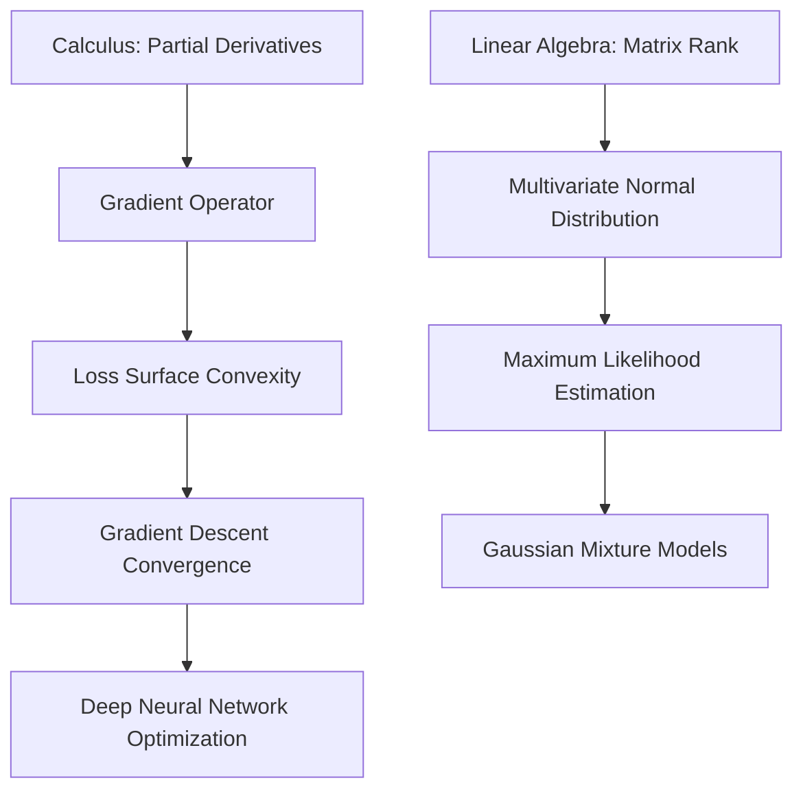

# SYSTEM_EVAL: Comprehensive Technical Evaluation, Code Audit, and Architectural Blueprint

---

## 1. Executive Summary & Problem Statement

The **Lecture Comprehension Gap Detector (`LecGap`)** is built to solve a critical pedagogical challenge: converting passive lecture watching into an active, diagnostic, and remediated learning experience. The intended pipeline ingests raw lecture audio/video, extracts taught academic concepts, classifies prerequisite dependencies into a Directed Acyclic Graph (DAG), administers diagnostic quizzes, and guides students through personalized remediation clips based on their comprehension gaps.

However, a granular code audit across the entire repository reveals that our current system relies heavily on fragile heuristics, disconnected string matching, and narrow 15-second context blinders. This creates an **"illusion of intelligence"** where the product appears to function in happy-path demos, but under scrutiny produces:
- **Corrupted and out-of-context video clips** (cutting mid-sentence or freezing on keyframes).
- **Infeasible quiz questions** (verbatim transcript sentence matching rather than conceptual diagnostics).
- **A pseudo-prerequisite classifier** that never reads the lecture transcript, relying instead on a static 208-topic dataset from 2019.
- **Race conditions** that silently drop graph creation entirely during UI interactions.
- **Circular synthetic validation** that hands LLMs the answer key.

This document compiles the complete findings, line-by-line debugging traces, and architectural designs needed to elevate this project beyond passive tools like **Google's NotebookLM**.

---

## 2. End-to-End Lecture Lifecycle: Step-by-Step Code Walkthrough

Below is the complete trace of a lecture from user upload to quiz submission:

```
[User Media Upload] (MP4/MKV/WAV/M4A/MOV)
       │
       ▼ (FastAPI POST /lectures in backend/api/routes.py)
[Storage] ──> Copied verbatim to data/raw/lec<id>_<filename>
       │
       ▼ (FastAPI BackgroundTask: _process_lecture)
[Stage 1: Audio Transcription] (backend/pipeline/transcribe.py)
       ├── Downmixed to mono 16kHz FLAC via FFmpeg (_downmix_to_flac)
       ├── Blindly sliced into fixed 300s time chunks (_split_flac)
       └── Transcribed via Groq Whisper API (whisper-large-v3-turbo) or Local Whisper Base
       │
       ▼ (DB Persistence: TranscriptSegment rows: idx, start_s, end_s, text)
[Frontend Streamlit Action] (frontend/app.py)
       │ User clicks "Extract concepts + build graph"
       ├── POST /lectures/{id}/concepts (Runs in Background)
       └── POST /courses/{id}/graph    (Runs in Background AT THE EXACT SAME TIME)
       │
       ▼ (CRITICAL RACE CONDITION TRIGGERED)
[Stage 2: Spoken Concept Extraction] (backend/pipeline/extract_concepts.py)
       ├── Segments batched into coarse ~12,000 char chunks (~5-10 min of audio)
       ├── Prompt sent to Groq LLaMA/Qwen: "Identify academic concepts"
       ├── EVERY concept receives the chunk's ENTIRE start_s and end_s
       └── refine_timeline.py:
             ├── If span > 90s, runs naive substring search for concept name
             ├── Stride-samples text if not found (skips sentences)
             └── Clamps to artificial 20s minimum window
       │
       ▼ (DB Persistence: Concept rows: name, source, implicit, start_s, end_s)
[Stages 3 & 4: Prerequisite Classification & Graph Construction]
       │ (backend/pipeline/classify_prerequisites.py & build_graph.py)
       ├── Fetches Concept rows (Frequently EMPTY due to the race condition!)
       ├── Pairs pre-filtered by: temporal proximity (<120s) OR MiniLM cosine similarity (>0.6)
       ├── Pairs classified by Logistic Regression trained on static 'LectureBank' 208-topic CSV
       │     (Does NOT read the lecture transcript at all!)
       ├── Graph assembled in NetworkX DiGraph
       └── Cycles broken by blindly dropping the lowest-confidence edge (resolve_cycles)
       │
       ▼ (DB Persistence: GraphNode and GraphEdge rows)
[Stage 5: Clip Segmentation] (backend/pipeline/segment_clips.py)
       └── FFmpeg called with `-c copy -ss start -to end` (Cuts on keyframes, causing freezes/desync)
       │
       ▼ (POST /quizzes in backend/api/routes.py)
[Stage 6: Quiz Generation] (backend/pipeline/quiz.py & mcq_gen.py)
       ├── For each concept, grabs local window of n=3 segments (~15s total)
       ├── LLM prompted to generate MCQ from this 15-second snippet
       └── If LLM fails/times out: Fallback to verbatim sentence matching (make_mcq)
             (Answer = literal sentence; Distractors = literal sentences from OTHER concepts)
       │
       ▼ (POST /quizzes/submit in backend/api/routes.py)
[Stage 7: Student Remediation Loop] (backend/pipeline/quiz.py & routes.py)
       ├── Student wrong answers identified
       ├── Graph traversed for upstream prerequisite concepts via transitive closure
       └── Attached FFmpeg clips returned in topological order
```

---

## 3. The "Hall of Illusions": Where the Code Breaks & Tricks the User

### 3.1. The Instant Race Condition Illusion
* **Code Location:** [`frontend/app.py:80–94`](file:///c:/Users/hp/Desktop/lecture-comprehension-gap-detector/frontend/app.py#L80-L94) and [`backend/api/routes.py:501–530`](file:///c:/Users/hp/Desktop/lecture-comprehension-gap-detector/backend/api/routes.py#L501-L530)
* **The Illusion:** The user clicks *"Extract concepts + build graph"* in Streamlit. The UI immediately displays a green success banner: `Queued extraction + graph build for course 'ml1'`. The user assumes the system will process concepts and then build the graph.
* **The Reality:** Both endpoints are spawned as concurrent non-blocking `BackgroundTasks`. Concept extraction takes 15–45 seconds. Graph building queries `db.query(Concept)` **immediately**. Finding 0 concepts, `_build_course_graph_worker` executes:
  ```python
  rows = (
      db.query(Concept)
      .filter(Concept.course_id == course_id)
      .order_by(Concept.id)
      .all()
  )
  if not rows:
      return
  ```
  It exits silently with **zero errors logged**. The graph is left completely blank. When the user later navigates to take a quiz or view the graph, the system either throws a 404 or renders an empty canvas.

---

### 3.2. Video Clip Trimming & FFmpeg Keyframe Corruption
* **Code Location:** [`backend/pipeline/segment_clips.py:30, 71–73, 122–139`](file:///c:/Users/hp/Desktop/lecture-comprehension-gap-detector/backend/pipeline/segment_clips.py#L30)
* **Observation:** Clips in `data/processed/clips/` are either disjointed micro-clips or bloated chunks.
* **The Problem (Trimming Too Much vs. Too Little):**
  - **Trimming Too Much:** The system trims media strictly to the timestamp where a concept keyword was detected, capturing an isolated 15–20 second fragment. It cuts mid-sentence without problem formulation, derivation, or conclusion.
  - **Trimming Too Little:** When refinement fails, it falls back to the coarse 10-minute chunk, dumping unwatchable, multi-minute lecture slices into the student's remediation queue.
* **The Stream-Copy Keyframe Bug:** In `cut_clip`:
  ```python
  cmd = [ffmpeg, "-y", "-ss", f"{start:.3f}", "-to", f"{end:.3f}", "-i", media_path]
  cmd += ["-c", "copy"] + [out_path]
  ```
  Stream copy (`-c copy`) can only cut on **Keyframes (I-frames)**. In standard H.264 lecture recordings, keyframes occur every 5 to 10 seconds. Cutting an arbitrary 20-second span causes the video stream to freeze or turn black for the first 3–6 seconds while the audio plays out of sync. Furthermore, the cut point snaps to the nearest preceding keyframe, which could belong to an entirely different topic or slide.
* **Recommendation:** Implement dynamic padding and semantic chunking. Before cutting, analyze the transcript to find the true "topic boundary" (e.g., +/- 30 seconds of padding, or use an LLM to identify the logical start and end of the explanation, not just the timestamp of the keyword). Replace `-c copy` with fast re-encoding (`-c:v libx264 -preset veryfast -crf 22 -c:a aac`) to guarantee frame-accurate cuts.

---

### 3.3. The Timestamp Fabrication & Strided Window Illusion
* **Code Location:** [`backend/pipeline/extract_concepts.py:122–130`](file:///c:/Users/hp/Desktop/lecture-comprehension-gap-detector/backend/pipeline/extract_concepts.py#L122-L130) and [`backend/pipeline/refine_timeline.py:80–161`](file:///c:/Users/hp/Desktop/lecture-comprehension-gap-detector/backend/pipeline/refine_timeline.py#L80-L161)
* **The Illusion:** The UI shows a timeline where each concept is supposedly anchored to its exact teaching passage.
* **The Reality:**
  1. `extract_spoken_concepts` stamps **every single concept** with the entire 12,000-character chunk's `[start_s, end_s]` span.
  2. To refine this, `refine_timeline.py` does a naive lowercase substring match:
     ```python
     mention = next((i for i, s in enumerate(segs) if name.lower() in _txt(s).lower()), None)
     ```
     If the concept is implicit (e.g., the concept is *Overfitting* but the lecturer says *"the model memorized the training set"*), `name.lower()` is not found.
  3. When the match fails, the code falls back to stride-sampling:
     ```python
     step = max(1, math.ceil(total / max_chars))
     segs = segs[::step]
     ```
     It literally deletes every 2nd or 3rd sentence of the lecture, glues the fragmented lines together, and asks the LLM to guess start/end seconds from a corrupted transcript!
  4. If the LLM pins a short 5-second sentence, line 153 artificially pads it by +/- 10 seconds:
     ```python
     if ne - ns < MIN_TIGHT_S:
         mid = (ns + ne) / 2.0
         ns = max(cs, mid - MIN_TIGHT_S / 2.0)
         ne = min(ce, ns + MIN_TIGHT_S)
     ```
     The timestamps are synthetic approximations rather than true pedagogical boundaries.

---

### 3.4. The "Deaf & Blind" Prerequisite Classifier
* **Code Location:** [`backend/pipeline/classify_prerequisites.py:74–90, 173–197, 279–320`](file:///c:/Users/hp/Desktop/lecture-comprehension-gap-detector/backend/pipeline/classify_prerequisites.py#L74-L90)
* **The Illusion:** The system claims to analyze the lecture content to discover prerequisite relationships between concepts.
* **The Reality:**
  1. **Candidate Pair Blinders:** `get_candidate_pairs` only evaluates pairs if they are within 120 seconds of each other OR have an embedding cosine similarity $\ge 0.6$. If a foundational concept from Lecture 1 (e.g., *Matrix Inversion*) is required for an advanced concept in Lecture 4 (e.g., *Ordinary Least Squares closed-form*), they are separated by hours and have low cosine similarity (~0.45). **The system never even considers them as candidate pairs.**
  2. **Zero Transcript Context:** When `PrerequisiteClassifier` runs, it computes:
     ```python
     _pair_features(pairs, cache) # Concatenated all-MiniLM-L6-v2 vectors of concept name strings!
     ```
     It literally feeds just the two string names (e.g., `"Vector"` and `"Dot Product"`) into a static Logistic Regression trained on a 208-topic computer science list (`data/lecturebank/208topics.csv`). **The classifier does not read a single word of what the professor actually said in the lecture.** It is a static dictionary lookup masquerading as a dynamic lecture comprehension model.
  3. **The Unused LLM Check:** The file defines `llm_reasoning_check()`, which supposedly provides a second opinion with natural language explanations. **This function is never imported or called in any production route or worker in the entire repository.**

---

### 3.5. Quiz Generation Feasibility: Syntax-Matching vs. Garbage
* **Code Location:** [`backend/pipeline/mcq_gen.py:90–158`](file:///c:/Users/hp/Desktop/lecture-comprehension-gap-detector/backend/pipeline/mcq_gen.py#L90-L158) and [`backend/pipeline/quiz.py:175–221`](file:///c:/Users/hp/Desktop/lecture-comprehension-gap-detector/backend/pipeline/quiz.py#L175-L221)
* **Observation:** The quiz generation can produce "garbage" or disconnected questions.
* **Why it's happening:**
  1. In `mcq_gen.py`, `local_context` restricts the LLM's view to **$n=3$ segments** (roughly 12–18 seconds of speech). In university lectures, an 18-second window is usually an introductory transition (e.g., *"Next, let's take a look at the definition of eigenvalues..."*). The LLM is asked to write a rigorous question with distractors and explanations without having seen the actual definition or explanation!
  2. When the LLM fails or times out, it triggers the fallback in `quiz.py` (`make_mcq`):
     - **Question:** *"Which statement best describes the concept 'Gradient Descent' as taught in the lecture?"*
     - **Answer (Key):** A raw verbatim sentence from the transcript (e.g., *"and we update theta by subtracting alpha times the derivative"*).
     - **Distractors:** Verbatim sentences plucked randomly from OTHER concepts!
       - Distractor 1: *"Please remember to submit assignment two by midnight."*
       - Distractor 2: *"Let me grab another piece of chalk."*
       - Distractor 3: *"It has no effect on the outcome"* (from `_DEFAULT_DISTRACTORS`).
  3. This is not a quiz; it is a sentence-recognition puzzle. It measures whether a student memorized verbatim transcript strings, not whether they understand the underlying principles.
* **Recommendation:**
  - Increase the context window $n$ (e.g., 5–10 segments or the full pedagogical episode) for the LLM so it fully understands the concept.
  - If falling back to non-LLM generation, ensure distractors are semantically aligned (e.g., using embeddings to find similar but distinct concepts rather than random sentences).

---

### 3.6. The Circular "Synthetic Student" Validation
* **Code Location:** [`backend/pipeline/refine.py:180–208`](file:///c:/Users/hp/Desktop/lecture-comprehension-gap-detector/backend/pipeline/refine.py#L180-L208)
* **The Illusion:** Stage 7 claims to prove experimentally that student quiz failure patterns can recover a hidden ground-truth dependency graph.
* **The Reality:** In `generate_synthetic_students`, the LLM persona prompt is constructed as follows:
  ```python
  deps = "\n".join(f"- {e['target']} requires {e['source']}" for e in edges)
  system = (
      "You are a student taking a course. You were taught only a limited "
      "set of topics, and you have NOT learned anything beyond that set.\n"
      "The course material establishes these dependencies:\n"
      f"{deps}\n"
      "You reason carefully: if a topic requires a prerequisite that was "
      "NOT in your taught set, you have not mastered that topic..."
  )
  ```
  **The prompt explicitly hands the LLM the answer key of the hidden graph!** The LLM is not discovering anything; it is simply repeating the logical rules handed to it in the system prompt. Evaluating graph recovery on this synthetic data is completely circular.

---

### 3.7. The Blind Slicing Audio Illusion
* **Code Location:** [`backend/pipeline/transcribe.py:114–150`](file:///c:/Users/hp/Desktop/lecture-comprehension-gap-detector/backend/pipeline/transcribe.py#L114-L150)
* **The Illusion:** The system claims to transcribe full lectures robustly by slicing audio into 300-second pieces (`_split_flac`).
* **The Reality:** Slicing is strictly temporal: `start += chunk_s` with `ffmpeg -ss ... -t ...`. It cuts audio **blindly in the middle of spoken words and technical equations**.
  - Whisper models fed a clipped audio chunk that starts mid-phoneme regularly suffer from hallucination loops (repeating phrases indefinitely) or dropping the first 5–10 seconds of speech.
  - Timestamps at chunk boundaries lose sub-second synchronization, leading to drifting subtitles downstream.

---

## 4. The Concept DAG: Is it Perfect and What Can We Do With It?

### 4.1. Current Usage & Why It Is NOT Perfect
* **Current Usage:** `build_graph.py` builds a DAG to compute topological order, which `quiz.py` uses to generate remediation sequences (prerequisites before dependents).
* **Is it perfect?** No. Automatically generated graphs from LLMs often hallucinate dependencies, miss links, or create cycles. The system arbitrarily drops the lowest-confidence edge to break cycles (`resolve_cycles`), which might drop crucial relationships:
  - It relies on a toy dataset of 208 Computer Science labels from 2019.
  - It evaluates isolated concept string pairs without the surrounding lecture context.
  - If the classifier predicts $A \rightarrow B$ and $B \rightarrow A$ with confidences 0.61 and 0.62, the cycle breaker deletes the 0.61 edge without any semantic verification, potentially inverting real pedagogical relationships.

### 4.2. What a Pedagogical DAG Should Actually Represent
A true pedagogical graph is a **Skill & Prerequisite Lattice**:



### 4.3. High-Value Capabilities of a Valid DAG
1. **Root-Cause Knowledge Gap Tracing:**
   When a student fails an assessment on *Backpropagation*, the system should not simply re-show Backpropagation. It should traverse the DAG backwards:
   - Did they fail because of the *Multivariate Chain Rule*?
   - Did they fail because of *Matrix Transposition in Gradient Calculation*?
   - Pinpoint the exact upstream foundation where comprehension broke down.
2. **Bayesian Knowledge Tracing (BKT) / Graph Neural Networks:**
   Maintain a probability of mastery $P(Mastery_i)$ for every node in the graph for each student. When a question is answered, propagate belief updates upstream and downstream across edges.
3. **Curriculum Coherence & Divergence Detection for Instructors:**
   Compare the professor's **Taught Order** (the chronological timeline of the lecture) with the graph's **Topological Order** (the logical dependency sequence). If a professor introduces a dependent concept 20 minutes *before* explaining its foundational prerequisite, flag this as a **"High Cognitive Load Inversion"** in the faculty dashboard.
4. **Visual Learning Maps:**
   Render this graph in the frontend so students can visually track their progress and see their "knowledge gaps" mapped out.
5. **Adaptive Testing:**
   Instead of a linear quiz, use the DAG for adaptive testing. If a user fails a dependent concept, immediately test the prerequisites to find the root cause of the gap.

---

## 5. Benchmarking Against NotebookLM: How to Surpass It

### 5.1. Current State vs. NotebookLM
* **Current State:** NotebookLM excels at passive consumption—chatting over documents, synthesizing podcasts, and citing sources. Our system is trying to do active learning (assessment + remediation).
* **Is it better currently?** Currently, no, because NotebookLM's synthesis is highly polished, whereas our quizzes and clips feel fragmented and out of context.

### 5.2. Where NotebookLM Fails (Our Strategic Moat)
* **NotebookLM is completely PASSIVE:** It is an interactive encyclopedia and summarizer. It does not test you, does not measure what you actually retained, does not know what you misunderstood, and does not adapt to your cognitive state.
* **No Conceptual Dependency Engine:** NotebookLM cannot tell you: *"You are struggling with Topic D because you lack mastery of Topic B, which was mentioned on Slide 4."*
* **No Remediation Pathways:** It cannot deliver targeted micro-learning interventions calibrated to close diagnosed gaps.

### 5.3. Comparison Matrix

| Dimension | Google NotebookLM | Our Target System (`LecGap Pro`) |
| :--- | :--- | :--- |
| **Learning Paradigm** | Passive Consumption (Read/Listen) | **Active Diagnostic Learning (Test $\rightarrow$ Diagnose $\rightarrow$ Remediate)** |
| **Cognitive Modeling** | None (Stateless Q&A) | **Student Knowledge State Graph (Dynamic Mastery Tracking)** |
| **Lecture Processing** | Flat text dump into LLM | **Multimodal Pedagogical Episodes (Slide OCR + Spoken Track + Derivations)** |
| **Assessments** | Generic flashcards / surface trivia | **Deep Misconception Diagnostics (Bloom's Taxonomy Levels 3–5)** |
| **Remediation** | Read the full summary again | **Precision Video Anchors + Targeted Conceptual Bridges** |
| **Instructor Insights** | None | **Class-wide Confusion Heatmaps & Syllabus Inversion Warnings** |

### 5.4. Strategies to Surpass NotebookLM
- **Active vs. Passive:** Lean into our unique value proposition: targeted assessments. NotebookLM doesn't test you and enforce learning paths. We do.
- **Spaced Repetition:** Use the DAG to schedule quizzes over time.
- **Contextual Synthesis:** Instead of raw ffmpeg clips, use LLMs to summarize the prerequisite gap before showing the clip, giving the user a "bridge" explanation connecting their misconception to the prerequisite concept.

---

## 6. Deep NLP: Exploiting the Entire Transcript

Transcription is expensive. Throwing away 95% of the transcript context and passing 3-sentence windows to an LLM wastes the primary asset of the system.

Here is how modern NLP and Deep Learning should be utilized across the entire transcript:

```
Full Audio Stream ──> Whisper Large-v3 with Word-Level Timestamps
                             │
                             ▼
     [Hierarchical Transcript Representation]
     ├── Lexical Tier: Word-level timestamps & confidence scores
     ├── Acoustic Tier: Pause durations, pitch inflection (emphasis/repetition)
     └── Discourse Tier: Speaker turns & question-answer exchanges
                             │
                             ▼
  [Dense Semantic Segmentation (Neural Topic Modeling)]
     ├── Sliding Window SentenceTransformer (e.g., BGE-Large / E5-Mistral)
     ├── Cosine Distance Matrix + Changepoint Detection (Kernel CP / TextTiling)
     └── Semantic Boundary Snapping (Align with acoustic pauses > 1.5s)
                             │
                             ▼
          [Pedagogical Episode Extraction]
     ├── Problem Formulation / Motivation (Why do we need this?)
     ├── Formal Definition / Core Theorem
     ├── Worked Example / Mathematical Derivation
     ├── Intuition & Visual Metaphor
     └── Edge Cases, Failure Modes & Common Misconceptions
```

### Key Technical Upgrades:
1. **Dynamic Acoustic-Semantic Boundary Detection:**
   - Rather than cutting clips on arbitrary seconds, compute embeddings for rolling 30-second windows with 5-second strides.
   - Compute the semantic divergence between adjacent windows. Spikes in divergence indicate a topic transition.
   - Snap boundaries to the nearest acoustic silence (pauses $> 1.5\text{s}$) using Whisper word-level timestamps.
   - This ensures video clips are self-contained **pedagogical episodes** (complete thoughts with problem statement and resolution).
2. **Whole-Lecture Context Ingestion via Long-Context Models:**
   - Modern frontier models possess context windows exceeding 128K to 1M tokens. An entire 2-hour university lecture is typically only 18,000 to 25,000 words (~30,000 tokens).
   - Ingest the entire transcript into a long-context model in a single pass to construct the comprehensive narrative map, track recurring motifs, and resolve cross-lecture references.

---

## 7. Code Structure & Modularity: Moving to Domain-Driven Layers

### 7.1. Current Modularity Flaws
* **Observation:** The code is not modular enough. Logic is heavily jumbled together in the `backend/pipeline` directory.
* **Specific Issues:**
  - `quiz.py` handles both graph traversal (`select_remediation_sequence`) and string manipulation for fallback MCQs.
  - `mcq_gen.py` handles LLM interactions but is disconnected from the main domain models.
  - There is no clear separation of concerns (Domain vs. Infrastructure vs. Application). Pipeline stages are mixed with business logic.
  - Graph algorithms are scattered between `build_graph.py`, `routes.py`, and `quiz.py`.

### 7.2. Proposed Clean Architecture
Refactor the codebase into a layered, domain-driven structure:

```
backend/
├── core/                        # Global configs, logging, telemetry
│   ├── config.py
│   └── exceptions.py
├── domain/                      # Pure business models & mathematical contracts (NO DB, NO LLM)
│   ├── concept.py               # Concept, ConceptSpan, PedagogicalRole
│   ├── graph.py                 # DependencyGraph, CycleResolver, TopologicalSort
│   ├── assessment.py            # DiagnosticQuestion, DistractorRationale, StudentState
│   └── remediation.py           # RemediationPath, CognitiveGap
├── infrastructure/              # External services, hardware wrappers, DB
│   ├── db/
│   │   ├── models.py            # SQLAlchemy tables
│   │   └── repository.py        # Clean database transactions
│   ├── media/
│   │   ├── ffmpeg_transcoder.py # Precise keyframe re-encoding, audio normalization
│   │   └── video_segmenter.py   # Scene detection, slide OCR
│   ├── speech/
│   │   ├── whisper_client.py    # Local & Cloud Whisper with word-level timing
│   │   └── acoustic_parser.py   # Silence/pause detection
│   └── llm/
│       ├── provider.py          # Unified client (Groq, Anthropic, Gemini, Ollama)
│       └── prompts/             # Versioned, strictly structured prompts
├── services/                    # Orchestration workflows (Application Layer)
│   ├── ingestion_service.py     # Audio extract -> Transcribe -> Discourse segment
│   ├── concept_service.py       # Global extraction -> Deduplication -> Grounding
│   ├── graph_service.py         # Prerequisite extraction -> Cycle resolution -> Divergence
│   ├── assessment_service.py    # Diagnostic MCQ generation -> Grounded distractor rationales
│   └── remediation_service.py   # Student response grading -> Bayesian update -> Targeted clip path
└── api/                         # FastAPI presentation layer (HTTP only)
    ├── dependencies.py
    └── v1/
        ├── lectures.py
        ├── courses.py
        ├── quizzes.py
        └── analytics.py
```

---

## 8. Concrete Action Items for Next Iteration

1. **Resolve UI Race Conditions:** Chain concept extraction and graph construction into a sequential background pipeline with explicit status tracking (`processing` $\rightarrow$ `concepts_extracted` $\rightarrow$ `graph_built`).
2. **Fix Video Clipping:** Replace `-c copy` in `segment_clips.py` with fast re-encoding (`-c:v libx264 -preset veryfast -crf 22 -c:a aac`) and add 15-second acoustic-aligned padding.
3. **Upgrade Quiz Generation:** Feed full pedagogical episodes into the LLM instead of 3-segment windows, and enforce schema validation with Pydantic.
4. **Transition to Context-Aware Prerequisites:** Move away from static 208-topic embeddings; utilize transcript evidence to determine why concept $A$ precedes concept $B$.
5. **Decouple Modules:** Refactor `backend/pipeline/` into distinct Domain, Infrastructure, and Application Service layers.
6. **Implement Student Knowledge Tracking:** Record response latency and specific distractor selections to diagnose the exact misconception rather than just binary correct/incorrect scores.
