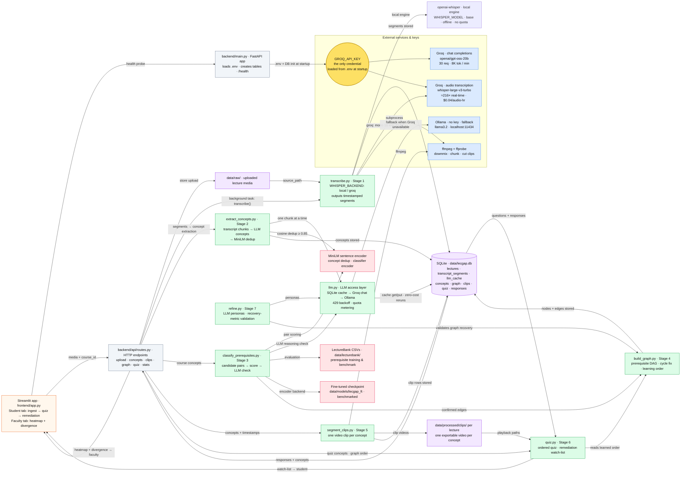

# LecGap — System Data-Flow Chart

**TL;DR — one credential, one loop.** A lecture video is uploaded, transcribed
into timestamped segments (locally or via Groq), an LLM pulls concepts out and
MiniLM merges near-duplicates, the prerequisite classifier + LLM check turn
them into a dependency graph (DAG), clips are cut per concept, a student's
wrong quiz answers are lifted through that DAG into an ordered watch-list —
and faculty see the class's confusion heatmap plus the taught-vs-learned
divergence. The only API key in the whole system is `GROQ_API_KEY`.

## How it flows, step by step

1. **Upload** — the Streamlit app (or `POST /lectures`) stores the file in
   `data/raw/` and kicks off a background transcription task.
2. **Transcribe (Stage 1)** — `transcribe.py` produces the same
   `[start, end, text]` segments from either the local Whisper engine or
   Groq-hosted Whisper (≈216× real-time; mono 16 kHz FLAC, auto-chunked).
3. **Extract concepts (Stage 2)** — the transcript is chunked and an LLM names
   explicit + implicit concepts; MiniLM merges near-duplicates.
4. **Build the prerequisite graph (Stages 3-4)** — candidate concept pairs are
   scored by the MiniLM classifier (LectureBank-trained), cross-checked by an
   LLM, and assembled into a cycle-free DAG with a learning order.
5. **Cut clips (Stage 5)** — ffmpeg exports one video per concept for playback.
6. **Quiz + remediation (Stage 6)** — a student's wrong answers are lifted
   through the DAG into a dependency-ordered watch-list of clips.
7. **Learn + refine (Stages 7-8)** — LLM personas validate the refinement
   mechanic, and the faculty tab reads the same tables for the confusion
   heatmap and taught-vs-learned divergence.

## Reading the chart

| Colour | Meaning |
|---|---|
| Yellow | API keys / secrets — the **only** credential is `GROQ_API_KEY`; Ollama needs none |
| Blue | External services (Groq chat, Groq Whisper, Ollama, ffmpeg) |
| Green | Pipeline logic (Stages 1-7) |
| Purple | Storage (SQLite + media files) |
| Pink | ML artifacts (MiniLM, LectureBank, fine-tuned checkpoint) |
| Orange | Frontend (Streamlit) |
| Grey | FastAPI surface |

## Every API key in the system

| Key | Where | Used by |
|---|---|---|
| `GROQ_API_KEY` | `.env` (also in the OS environment for convenience) | `llm.py` chat (`openai/gpt-oss-20b`) and `transcribe.py` Whisper (`whisper-large-v3-turbo`) |

No other credentials exist — Ollama is a local keyless fallback and
ffmpeg/MiniLM run on-device.

---

> **Maintenance note:** this exact diagram is also embedded in the project
> README (section "System data flow"). Keep the two copies in sync when the
> architecture changes.